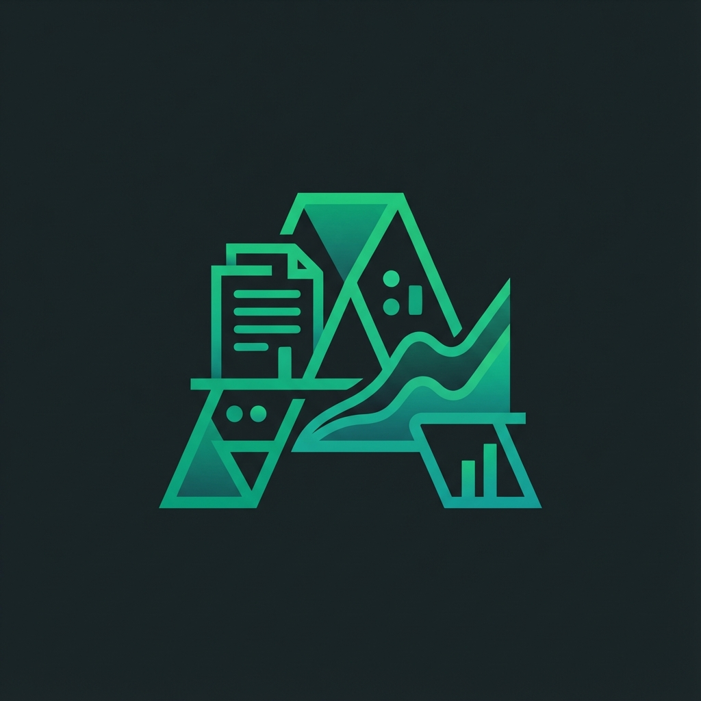

# Arthyx 💹
**Autonomous Quantitative Financial Analyst | Powered by Gemini 2.0 & Knowledge Graphs**



> *"Arth"* (Sanskrit: Meaning, Wealth, Finance) + *"Analytical Efficiency"*.

**Arthyx** is an industry-grade autonomous financial agent designed to process, analyze, and audit complex financial documents at scale. Unlike standard RAG chatbots, Arthyx combines **Semantic Search**, **Knowledge Graphs**, and **Quantitative Risk Modeling** to deliver institutional-grade insights from Annual Reports, BASEL III filings, and Regulatory Frameworks (RBI/SEBI).

---

## 🚀 Why Arthyx?
In the world of quantitative finance, context is everything. Standard LLMs hallucinate numbers and miss subtle regulatory nuances. Arthyx solves this by treating financial documents not just as text, but as **structured data networks**.

*   **⚡ Blazing Fast Extraction**: Processes 500+ page PDFs in seconds using parallelized embedding pipelines.
*   **🧠 Deep Context RAG**: Retrieves 40k+ characters of context per query using Gemini 2.0 Flash's massive window.
*   **🇮🇳 specialized for India**: Fine-tuned OCR for Hindi, Tamil, Bengali, & Gujarati financial scripts.
*   **🕸️ Knowledge Graph Auditing**: Detects hidden relationships (shell companies, director conflicts) using Neo4j.

---

## 🛠️ Tech Stack (Production Grade)
Built on a high-performance, type-safe stack designed for reliability and scale.

*   **Intelligence**: Google Gemini 2.0 Flash (Reasoning), `text-embedding-004` (Vectorization).
*   **Vector Database**: Pinecone Serverless (p2) for <50ms semantic retrieval.
*   **Graph Database**: Neo4j AuraDB for entity relationship modeling.
*   **Caching & State**: Upstash Redis for session management and job queues.
*   **Frontend**: Next.js 15 (Turbopack), TailwindCSS, Framer Motion (60fps animations).
*   **Infrastructure**: Render (Node.js Worker Streams), Vercel Blob.

---

## 🔮 Key Capabilities

### 1. The "Deep-Dive" Engine
Arthyx doesn't just read summaries. It indexes full document chunks (3000 chars) and retrieves 15-20 distinct sections to synthesize answers with **complete context**. It cites page numbers strictly, like a human analyst.

### 2. Quantitative Risk Modeling
Automatically extracts financial ratios (NPA, CRAR, RoA) and runs them against **Basel III** and **RBI** norms to generate instant credit risk scores.

### 3. Asynchronous Job Processing
Handles 100MB+ PDFs via a robust Async Polling architecture. No timeouts. No failures. Just progress bars and results.

---

## 📦 Installation & Setup

```bash
# Clone the repository
git clone https://github.com/IndAlok/Arthyx.git

# Install dependencies (Legacy Peer Deps for Neo4j compatibility)
npm install --legacy-peer-deps

# Run Development Server
npm run dev
```

### Environment Config
Create a `.env.local` file with the following keys:
```env
GOOGLE_API_KEY=...
PINECONE_API_KEY=...
NEO4J_URI=...
UPSTASH_REDIS_REST_URL=...
```

---

## 🤝 Contribution
Arthyx is open-source software. We welcome contributions from efficient engineers and domain experts.
1.  Fork the Project
2.  Create your Feature Branch (`git checkout -b feature/QuantRisk`)
3.  Commit your Changes (`git commit -m 'Add: Monte Carlo Simulation'`)
4.  Push to the Branch (`git push origin feature/QuantRisk`)
5.  Open a Pull Request

---

*Designed and engineered by [Alok] for the future of Algorithmic Finance.*
